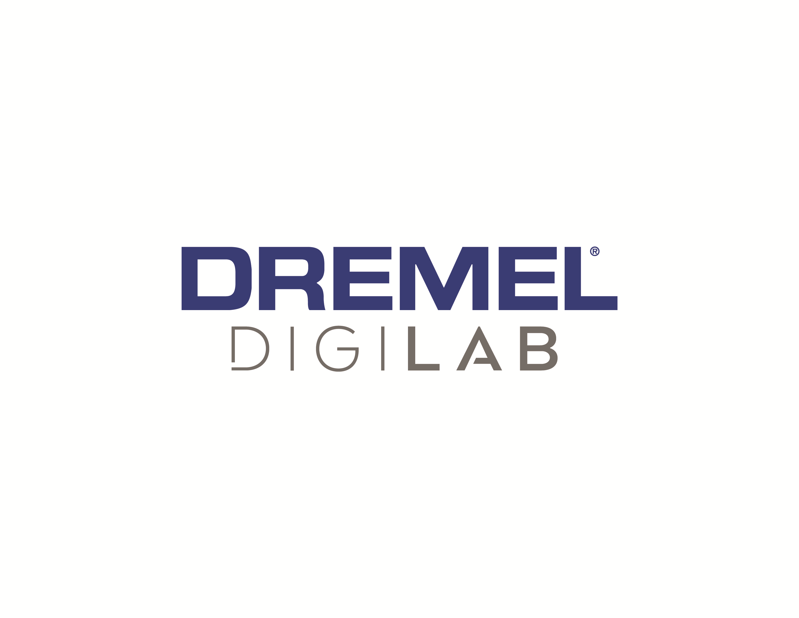
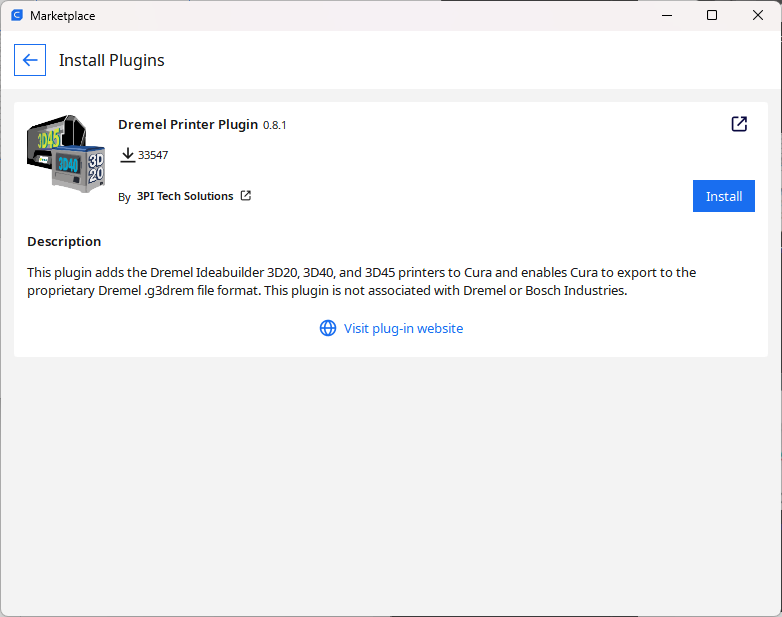

# Cura-Dremel-3D20-Plugin

https://github.com/timmehtimmeh/Cura-Dremel-3D20-Plugin/

This is a plugin for [Cura version 3.x and onward](https://ultimaker.com/en/products/ultimaker-cura-software) that adds the Dremel Ideabuilder 3D20 printer to Cura and enables Cura to export to the proprietary g3drem file format that the IdeaBuilder 3D20 uses.

# <a name="Table_Of_Contents"></a>Table Of Contents
- [Introduction](#Introduction)
- [Installation Instructions](#Installation)
- [Using the Plugin](#Using_the_Plugin)
- [Preview Image Options](#Preview_Image_Options)
- [Note](#Note)
- [Frequently Asked Questions](#FAQ)
- [Wishlist](#Wishlist)
- [Technical Details of the .g3drem File Format](#Technical_Details)
- [Contributors](#Contributors)
- [License](#License)

# <a name="Introduction"></a>Introduction
This plugin enables the user to select a Dremel Ideabuilder 3D20 printer for use with Cura, and to export the proprietary .g3drem files using Cura as the slicing engine.

Users should be aware that neither the author of this software nor Ultimaker are in any way associated nor affiliated with Dremel or Bosch Industries, and although the software functions well for the author and many other users, the author will not guarantee that using the software and the files that it produces won't break your 3D printer, set property on fire, or do other **really_bad_things**.  

This software is supplied without warranty and the user is responsible if they use this software and injury happens to their person or any other persons or damage occurs to any property as a result of using this software and/or the files that it creates.  Please remain near the 3D printer while using files generated by this software, and pay close attention to the 3D printer while it is on to verify that the machine is functioning properly. The software is provided AS-IS and any usage of this software or its output files is strictly at the user's own risk.

The code for this plugin is based upon the [Cura gcode writer plugin](https://github.com/Ultimaker/Cura/tree/master/plugins/GCodeWriter) and is released under a LGPL-3.0 license.  Source code for this plugin can be found [here](https://github.com/timmehtimmeh/Cura-Dremel-3D20-Plugin).


This software is released as a plugin for the [Ultimaker Cura](https://ultimaker.com/en/products/ultimaker-cura-software) Software.  The Dremel3D20 plugin contains the necessary printer files to add the Dremel IdeaBuilder 3D20 printer to Cura and enables Cura to export the proprietary g3drem file format that the Dremel 3D20 needs in order to print.

This plugin is now available within the Cura marketplace.  Users are encouraged to use the built-in Cura Marketplace to install & update this plugin rather than downloading the plugin directly from the releases page.  

**Note:**  For older versions of Cura, please read the table below to find the correct version:

| Cura Version | Last version of the plugin that works with the version of Cura         |
|--------------|------------------------------------------------------------------------|
4.4 through 4.5 | [version 0.6.2](https://github.com/timmehtimmeh/Cura-Dremel-3D20-Plugin/releases/tag/0.6.2)
3.5 through 4.3  | [version 0.5.9](https://github.com/timmehtimmeh/Cura-Dremel-3D20-Plugin/releases/tag/0.5.9)
3.4 or 3.4.1   | [version 0.4.8](https://github.com/timmehtimmeh/Cura-Dremel-3D20-Plugin/releases/tag/0.4.8)
3.3 or 3.3.1   | [version 0.4.3](https://github.com/timmehtimmeh/Cura-Dremel-3D20-Plugin/releases/tag/0.4.3)
3.2 or 3.2.1   | [version 0.4.2](https://github.com/timmehtimmeh/Cura-Dremel-3D20-Plugin/releases/tag/0.4.2)
3.0 or 3.1     | [version 0.2.5](https://github.com/timmehtimmeh/Cura-Dremel-3D20-Plugin/releases/tag/0.2.5)

---
# <a name="Installation"></a>Installation

To install the plugins, follow the instructions below:

0.  [Download and install Cura](https://ultimaker.com/en/products/ultimaker-cura-software) on your machine.  This plugin has been tested on Windows 10 Professional 64 bit edition, and MacOS 10.12 (Sierra), but this plugin should work equally well on linux or any other operating system that Cura supports.

1.  Open Cura, select the Marketplace menu, then select the "Browse Packages" item.  Cura will bring up the package browser.  Find the "Dremel 3D20" package in the list, then click install.

    

2. Cura will display a message window telling you to restart Cura.
    

3.  Close the Cura application

4.  Upon restart you should have an option to add a Dremel3D20 printer (see "Using the Plugin" section below) - Congratulations, the plugin is now installed!

---
# <a name="Using_the_Plugin"></a>Using the Plugin
Once the plugin has been installed you can use it by following the steps outlined below:
1. Open Cura & load an object that you want to print

2. Select the Dremel 3D20 as your printer (preferences->configure cura->printers->add)


3. Select a type of PLA filament.  By default the plugin uses the Dremel PLA filament that is included and installed with the plugin.


4. Set the slicing options that you want from the print settings in the upper right corner of the screen.


5. Press the slice button in the lower-right corner to tell Cura to slice the object using the selected settings.


6. Click the "save to file" button.  Ensure that .g3drem is chosen as the output file format.


The plugin implements the logic outlined in the [Preview Image Options](#Preview_Image_Options) section below to select a preview image on the Dremel screen.

7. Save this file to a SD card
8. Insert the SD card into your IdeaBuilder 3D20
9. Turn on the printer
10. Select the appropriate file to print.  
11. Click print on the 3D Printer
12. Enjoy - if you have any feature suggestions or encounter issues, feel free to raise them in the ["Issues" section](https://github.com/timmehtimmeh/Cura-Dremel-3D20-Plugin/issues/new).
---
# <a name="Preview_Image_Options"></a>Preview Image Options
The plugin has implemented the following logic for selecting a preview image that will show up on the Dremel screen.  The thick green line follows the default options which are selected at plugin installation.  To deviate from the default options you must intervene as outlined in the text below:


1. The plugin has an option to allow the user to select an image file manually for use as the preview on the Ideabuilder 3D20 screen.  To enable this feature, go to the Extensions menu, and select Dremel3D20 Printer Plugin->preferences and check the box next to the text that reads "Select Screenshot Manually."


Cura will then pop up a message stating that screenshot selection is enabled


To disable this feature after enabling it, simply click the "Toggle Screenshot Selection" menu item again, and a message will state that the screenshot selection is disabled.

After enabling manual selection, once the user selects a location to save the .g3drem file out a secondary file selection menu will be brought up allowing the user to select a screenshot.  If an image file is selected then it will be used, if the cancel button is pressed then the plugin will skip Step 2 and proceed to Step 3


2. If manual screenshot selection is disabled, then the plugin searches the directory where the user saves the .g3drem file for an image file with the same name.  If no valid image file with the same name is found in the same directory, then the plugin proceeds to Step 3.  Valid image extensions are .png, .jpg, .jpeg, .gif, and .bmp.  

```
For example if the user saves llama.g3drem to the dekstop and the desktop folder
has a llama.jpg image file within it then the llama.jpg file will be used as the
preview image on the Dremel:
```


([llama photo](https://en.wikipedia.org/wiki/Llama#/media/File:Llama_lying_down.jpg) by Johann "nojhan" Dréo, distributed under a CC BY-SA 2.0 FR license.)


3.   If a screenshot has not been found after steps 1 and 2, then the plugin attempts to take a screenshot of the main Cura window and save it to the file.  This is the default behavior of the plugin, and is what will happen normally if the user doesn't perform the actions listed in Steps 1 and 2.

4.  If the screenshot fails for some reason then a generic Cura icon will be selected as the preview image.

---
# <a name="Note"></a>Note
Please note the following:
* The plugin has been tested using the latest version of Cura noted in this README on Windows 10 x64.  Prior versions have been tested on MacOS Sierra (MacOS 10.12), MacOS El Capitan (10.11), and Ubuntu versions 17.10 and 16.04.  Testing on non-Windows platforms occurs much less frequently than on Windows.  If you are using another platform and encounter issues with the plugin, feel free to raise an issue with the ["Issues" section](https://github.com/timmehtimmeh/Cura-Dremel-3D20-Plugin/issues/new) of the plugin's website.
* This plugin has been tested to work in the basic print case, however users may still encounter problems with the print head crashing into your parts if you attempt to print multiple parts on the same print bed one-after-another instead of printing them all-at-once.

---
# <a name="FAQ"></a>Frequently Asked Questions
1. **Question:** *Does/Can this plugin support the Dremel 3D40/Dremel 3D45?*
   **Answer:** With some work *maybe* - see ["Issue #20"](https://github.com/timmehtimmeh/Cura-Dremel-3D20-Plugin/issues/20) for a more complete answer.  The author doesn't own and doesn't have access to a 3D40/3D45, and cannot commit to supporting any machine that they don't have direct access to.  Some users have been successful at getting the machine working with a modified version of this plugin, however it will require some work.  If any developer with access to a 3D40/3D45 wants to fork this plugin, the source code is released under a GPLv3 license.  Please credit this plugin as well as the [Cura gcode writer plugin](https://github.com/Ultimaker/Cura/tree/master/plugins/GCodeWriter) upon which this plugin is based.

2. **Question:** *I cannot find the plugin for an older version of Cura in the Ultimaker Cura marketplace*
   **Answer:** Unfortunately the marketplace only allows one version of the plugin to exist at the time.  As Ultimaker updates Cura they occasionally break compatibiltiy with older versions of plugins.  Users are encouraged to [update to the latest version of Cura](https://ultimaker.com/software/ultimaker-cura) and download the latest version of the plugin from the marketplace.  If a user is tied to a specific version of Cura then they can download & manually install older releases of the plugin [here](https://github.com/timmehtimmeh/Cura-Dremel-3D20-Plugin/releases)

---
# <a name="Wishlist"></a>Wishlist

If any user would like a feature added, please feel free to [raise an issue](https://github.com/timmehtimmeh/Cura-Dremel-3D20-Plugin/issues/new) to ask for it.  Any and all collaboration is welcome from users and/or developers.

---
# <a name="Technical_Details"></a>Technical Details of the .g3drem File Format
The g3drem file format consists of a few sections.  The header is a mix of binary data and ASCII data, which is followed by an 80x60 pixel bitmap image written to the file, which is then followed by standard 3d printer gcode saved in ASCII format.

**An Example of the binary header looks like this:**


A description of the current understanding of this file format is below:

| Binary Data                                     | Description                                                          |
|-------------------------------------------------|----------------------------------------------------------------------|
`67 33 64 72 65 6d 20 31 2e 30 20 20 20 20 20 20` | Ascii for 'g3drem 1.0      '               (See 1 below )            |
`3a 00 00 00 b0 38 00 00 b0 38 00 00 38 04 00 00` | Memory Locations #s and Time(sec)          (See 2 through 5 below )  |
`8f 04 00 00 00 00 00 00 01 00 00 00 19 00 03 00` | Filament(mm), Flags, Height, Infill, Shell (See 6 through 11 below)  |
`64 00 00 00 DC 00 00 00 01 ff [80x60 Bmp image]` | Speed, Temps, Material and BMP             (See 12 through 18 below) |
`[standard 3d printer gcode]`                     | Gcode in ASCII                             (See 19 below)            |

**The sections of the file are:**
1. `67 33 64 72 65 6d 20 31 2e 30 20 20 20 20 20 20` = ASCII text 'g3drem 1.0      '
2. `3a 00 00 00` = four-byte little-endian uint containing the offset in the file to the start of the thumbnail
3. `b0 38 00 00` = four-byte little-endian uint containing the offset in the file to the start of a large image
4. `b0 38 00 00` = four-byte little-endian uint containing the offset in the file to the start of the gcode
5. `38 04 00 00` = four-byte little-endian uint containing the number of seconds that the print will take
6. `8f 04 00 00` = four-byte little-endian uint containing the estimated number of millimeters of filament that the right extruder will use
7. `00 00 00 00` = four-byte little-endian uint containing the estimated number of millimeters of filament that the left extruder will use (always zero for Ideabuilder3D20)
8. `01 00` = two-byte little-endian ushort that consists of boolean OR-ed flags: 0x01=right extruder, 0x02=left extruder, 0x04=bed heating, 0x08=support enabled
9. `00 00` = A two-byte little-endian ushort number that contains the layer height in micrometers
10. `19 00` = A two-byte little-endian ushort number that contains the infill percentage
11. `03 00` = A two-byte little-endian ushort number containing the number of shell layers
12. `64 00` = A two-byte little-endian ushort number containing the print speed
13. `00 00` = A two-byte little-endian ushort number containing the platform temperature
14. `DC 00` = A two-byte little-endian ushort number containing the right extruder temperature
15. `00 00` = A two-byte little-endian ushort number containing the left extruder temperature. (always zero for Ideabuilder3D20)
16. `01` = A one byte unsigned number containing the material for the right extruder.  0 is ABS, 1 is PLA, 2 is dissolvable material, 15 is no material (Always 1 for Ideabuilder 3D20)
17. `ff` = A one byte unsigned number containing the material for the left extruder.  0 is ABS, 1 is PLA, 2 is dissolvable material, 15 is no material (Always 15 for Ideabuilder 3D20)
18. A bitmap containing the preview image that the Dremel 3D20 will use to display on the screen (See the [usage instructions](#Using_the_Plugin))  This plugin uses an image of size 80x60 pixels for the preview image, and automatically rescales user-selected and screenshot images to be 80x60.
19. Standard 3d printer gcode (Marlin flavor seems to be working, but if you encounter issues please feel free to raise them [here](https://github.com/timmehtimmeh/Cura-Dremel-3D20-Plugin/issues/new)

---
# <a name="Contributors"></a>Contributors
Many thanks belong to the following users, who have spent their time and energy to report issues and help make the plugin better:
* [WeavingColors](https://github.com/WeavingColors)
* [SwapFaceL](https://github.com/SwapFaceL)
* [metalman3797](https://github.com/metalman3797)
* [blablaaddi](https://github.com/blablaaddi)
* [Swizzler121](https://github.com/Swizzler121)
* [Appesteijn](https://github.com/Appesteijn)
* [Ghostkeeper](https://github.com/Ghostkeeper)
* [LipuFei](https://github.com/LipuFei)
* Tijs Kooij
* [diegopradogesto](https://github.com/diegopradogesto)
* The rest of the engineering team at [Ultimaker](https://ultimaker.com/)

---
# <a name="License"></a>License
The Cura-Dremel-3D20-Plugin is licensed under the GNU Lesser General Public License v3.0

Permissions of this copyleft license are conditioned on making available complete source code of licensed works and modifications under the same license or the GNU GPLv3. Copyright and license notices must be preserved. Contributors provide an express grant of patent rights. However, a larger work using the licensed work through interfaces provided by the licensed work may be distributed under different terms and without source code for the larger work.

For the complete license text, please see the [LICENSE file](https://github.com/timmehtimmeh/Cura-Dremel-3D20-Plugin/blob/master/LICENSE)
