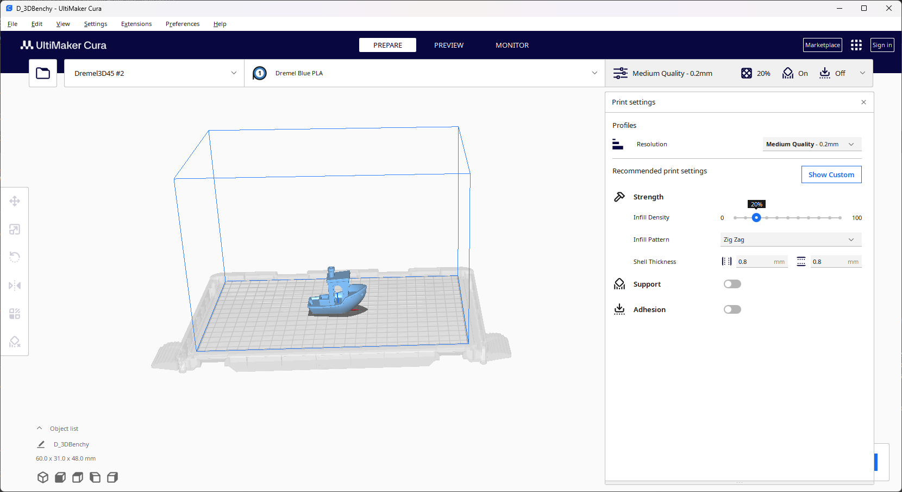

# Cura-Dremel-3D20-Plugin

Dremel Ideabuilder 3D20 plugin for [Cura version 3.4](https://ultimaker.com/en/products/ultimaker-cura-software). This plugin enables the user to select a Dremel Ideabuilder 3D20 printer for use with Cura, and to export the proprietary .g3drem files using Cura as the slicing engine.

Although the software functions reasonably well for the author, the author will not guarantee that the software won't break your 3D printer, set it on fire, or do other **really_bad_things**.  Users should be aware that neither the author nor Ultimaker are in any way associated with Dremel or Bosch Industries.  The software is supplied without warranty and the user is responsible if they use this software and bad things happen either to their person, their 3D printer, or any other property as a result of using this software, or the files that it creates.  Please remain near the 3D printer while using files generated by this software, and pay close attention to the 3D printer to verify that the machine is functioning properly. The software is provided AS-IS and any usage of this software or its output files is strictly at the user's own risk.

This code is **heavily** based upon the [Cura gcode writer plugin](https://github.com/Ultimaker/Cura/tree/master/plugins/GCodeWriter).  




This software consists of one plugin for Cura and an optionally installed 3d model of the Dremel print bed.  The Dremel3D20 plugin contains the necessary printer files to add the Dremel IdeaBuilder 3D20 to Cura and enables Cura to export the proprietary g3drem file format that the Dremel 3D20 needs.

**Note:**  This version of the Cura-Dremel-3D20-Plugin will not work with Cura versions 3.3.1 or earlier due to changes that Ultimaker implemented in the Cura architecture.  For a version that works with earlier Cura versions see the table below:

| Cura Version | Last version of the plugin that works with the version of Cura         |
|--------------|------------------------------------------------------------------------|
3.4 | [version 0.4.5](https://github.com/timmehtimmeh/Cura-Dremel-3D20-Plugin/releases/tag/0.4.5)
3.3 or 3.3.1 | [version 0.4.3](https://github.com/timmehtimmeh/Cura-Dremel-3D20-Plugin/releases/tag/0.4.3)
3.2 or 3.2.1 | [version 0.4.2](https://github.com/timmehtimmeh/Cura-Dremel-3D20-Plugin/releases/tag/0.4.2)
3.0 or 3.1 | [version 0.2.5](https://github.com/timmehtimmeh/Cura-Dremel-3D20-Plugin/releases/tag/0.2.5)

---
# Installation

**Note** As of release 0.4.0 the Dremel3D20 plugin now combines the functionality of the DremelGCodeWriter plugin as well as including the ability to automatically install the Dremel printer files.  If you had previously installed the DremelGCodeWriter plugin, please delete it from the following folders before proceeding:
- Windows:  $USER/AppData/Roaming/cura/$CURA_VERSION/plugins
        and
            %CURA_INSTALL_DIR%/plugins (i.e. C:\Program Files\Ultimaker Cura\plugins)

- Mac:      $User/Library/Application\ Support/Cura/$CURA_VERSION/plugins
        and
            Applications/Ultimaker Cura.app/Contents/Resources/plugins
- Linux:    $USER/.local/share/cura/$CURA_VERSION/plugins/

To install the plugins, follow the instructions below:

0.  [Download and install Cura](https://ultimaker.com/en/products/ultimaker-cura-software) on your machine.  This plugin has been tested on Windows 10 Professional 64 bit edition, and MacOS 10.12 (Sierra), but this plugin should work equally well on linux or any other operating system that Cura supports.

1.  Download the plugin files by navigating to the ["Releases"](https://github.com/timmehtimmeh/Cura-Dremel-3D20-Plugin/releases/latest) page to download the latest released version in zip format (named Cura-Dremel-3D20-Plugin-%version%.zip) and extract the zip file to your computer

2.  Navigate to the folder where you extracted the plugin

3.  Install the Dremel Printer Plugin by following the steps below

    1. Open Cura and open the folder with the .curapackage file that you extracted earlier

    2. Drag the .curaplugin file onto the main window of Cura.

    4. Cura will display a message window telling you to restart Cura.

    

    5.  Close the Cura application

    6.  (Optional) Copy the dremel_3D20_platform.stl to the `%CURA_INSTALL_DIR%/resources/meshes` folder (if you cloned the git repo this file is under Cura-Dremel-3D20-Plugin/resources/meshes/).  This file contains the 3D model of the Dremel Ideabuilder print bed.  On MacOS copy this file to the folder located at `Ultimaker Cura.app/Contents/Resources/resources/meshes/`  The easiest way on the mac to get to this folder is to right click on the Ultimaker Cura.app application and select the "show package contents" option.  Skip this step on Linux

    

    7.  Upon restart you should have an option to add a Dremel3D20 printer (see Usage section below) - the plugin is now installed!  

    **Note:** If any errors occurred the Dremel printer files contained within the plugin can be re-installed by going to the Extensions menu->Dremel3D20 Printer Plugin->preferences and checking the checkbox next to "Dremel 3D Printer File Installed?" text

    

**Note:**  If the Dremel3D20 plugin detects an installation in the main Cura application directory, it will pop up warnings telling the user to remove the old files before it installs the new files.  Once the old files in the main cura application directory have been removed the plugin will automatically install new files to the appropriate locations without user intervention.


---
# Uninstallation
To uninstall the Dremel printer files, open the Extensions menu->Dremel3D20 Printer Plugin->preferences and uncheck the box next to "Dremel 3D Printer File Installed?".  

To delete the plugin itself navigate to the directory listed below and delete the Dremel3D20 folder.
  - Windows:  $USER/AppData/Roaming/cura/$CURA_VERSION/plugins
  - Linux:  $USER/.local/share/cura/$CURA_VERSION/plugins/
  - Mac:  $User/Library/Application\ Support/Cura/$CURA_VERSION/plugins

**Note:**  These directories are subject to change at Ultimaker's discretion.  The latest information on these directories can be found on [this page](https://github.com/Ultimaker/Cura/wiki/Cura-Preferences-and-Settings-Locations)  

---
# Usage
Once the plugin has been installed you can use it by following the steps outlined below:
1. Open Cura
2. Select the Dremel 3D20 as your printer (cura->preferences->printers->add)


3. Select Dremel PLA filament (even if you're using a different brand) as your filament type - this enables the print quality settings for the Dremel3D20.


4. Set the slicing options that you want.

5. <a name="Step5"></a>(Optional, but recommended if using the screenshot feature outlined in the [Preview Image Options](#Preview_Image_Options) section below) Zoom in on the part until it fills the screen.  As the plugin saves out the .g3drem file it will grab a screenshot of the main Cura window for use as the preview image that is displayed on the Ideabuilder screen. The area inside the red box shown in the image below will be used in the screenshot (the red box will not appear in the actual Cura window when you use the plugin).  **Please Note:** The preview on the Dremel will be **much** better if you zoom in on the part that you're printing until the part fills the screenshot area.

For instance:


Will show this on the IdeaBuilder 3D20:


**Nifty Feature:** The screenshot will work with the visualizer plugins, so feel free to try the "xray view" or "layer view" options if you like those visualizations better.

6. Click "File->Save As", or "save to file", selecting .g3drem as the output file format.


7. Save this file to a SD card
8. Insert the SD card into your IdeaBuilder 3D20
9. Turn on the printer
10. Select the appropriate file to print.  
    The plugin implements the logic outlined in the [Preview Image Options](#Preview_Image_Options) section below to select a preview image on the Dremel screen.
11. Click print
12. Enjoy - if you have any feature suggestions or encounter issues, feel free to raise them in the ["Issues" section](https://github.com/timmehtimmeh/Cura-Dremel-3D20-Plugin/issues).
---
# <a name="Preview_Image_Options"></a>Preview Image Options
The plugin has implemented the following logic for selecting a preview image that will show up on the Dremel screen.  The thick dark line follows the default options which are selected at plugin installation.  To deviate from the default options the user must intervene as outlined in the text below:


1. The plugin allows the user to optionally select an image file for use as the preview on the Ideabuilder 3D20 screen.  To enable this feature, go to the Extensions menu, and select Dremel3D20 Printer Plugin->preferences and check the box next to the text that reads "Select Screenshot Manually."


Cura will then pop up a message stating that screenshot selection is enabled


To disable this feature after enabling it, simply click the "Toggle Screenshot Selection" menu item again, and a message will state that the screenshot selection is disabled.

After enabling manual selection, once the user selects a location to save the .g3drem file out a secondary file selection menu will be brought up allowing the user to select a screenshot.  If an image file is selected then it will be used, if the cancel button is pressed then the plugin will skip Step 2 and proceed to Step 3


2. If manual screenshot selection is disabled, then the plugin searches the directory where the user saves the .g3drem file for an image file with the same name.  If no valid image file with the same name is found in the same directory, then the plugin proceeds to Step 3.  Valid image extensions are .png, .jpg, .jpeg, .gif, and .bmp.  

```
For example if the user saves llama.g3drem to the dekstop and the desktop folder
has a llama.jpg image file within it then the llama.jpg file will be used as the
preview image on the Dremel:
```


([llama photo](https://en.wikipedia.org/wiki/Llama#/media/File:Llama_lying_down.jpg) by Johann "nojhan" Dréo, distributed under a CC BY-SA 2.0 FR license.)


3.   If a screenshot has not been found after steps 1 and 2, then the plugin attempts to take a screenshot of the main Cura window and save it to the file (explained in [Step 5 above](#Step5))  This is the default behavior of the plugin, and is what will happen normally if the user doesn't perform the actions listed in Steps 1 and 2.

4.  If the screenshot fails for some reason then a generic Cura icon will be selected as the preview image.

---
# Note
Please note the following:
* The plugin has been tested using Cura 3.2.1 on Windows 10 x64, MacOS Sierra (MacOS 10.12), MacOS El Capitan (10.11), and Ubuntu versions 17.10 and 16.04.  Testing on non-Windows platforms happens less frequently than on Windows.  If you are using another platform and encounter issues with the plugin, feel free to raise an issue with the ["Issues" section](https://github.com/timmehtimmeh/Cura-Dremel-3D20-Plugin/issues) above.
* While this plugin works in the basic print case, you may still encounter problems with the print head crashing into your parts if you attempt to print multiple parts on the same print bed one-after-another instead of printing them all-at-once.

---
# Wishlist
The following items would be great to add to this plugin - any and all collaboration is welcome - feel free to raise an issue if there's a feature you'd like
* Get this plugin integrated into Ultimaker's plugin repo
* Fix current issues with printer quality definitions (they don't work right now)
* Figure out a way Auto-install the printer bed .stl file in the same way as the other files (or get it integrated into Cura's repo).


---
# <a name="Technical_Details"></a>Technical Details of the .g3drem File Format
The g3drem file format consists of a few sections.  The header is a mix of binary data and ASCII data, which is followed by an 80x60 pixel bitmap image written to the file, which is then followed by standard 3d printer gcode saved in ASCII format.

**An Example of the binary header looks like this:**


A description of the current understanding of this file format is below:

| Binary Data                                     | Description                                                          |
|-------------------------------------------------|----------------------------------------------------------------------|
`67 33 64 72 65 6d 20 31 2e 30 20 20 20 20 20 20` | Ascii for 'g3drem 1.0      '               (See 1 below )            |
`3a 00 00 00 b0 38 00 00 b0 38 00 00 38 04 00 00` | Memory Locations #s and Time(sec)          (See 2 through 5 below )  |
`8f 04 00 00 00 00 00 00 01 00 00 00 19 00 03 00` | Filament(mm), Flags, Height, Infill, Shell (See 6 through 11 below)  |
`64 00 00 00 DC 00 00 00 01 ff [80x60 Bmp image]` | Speed, Temps, Material and BMP             (See 12 through 18 below) |
`[standard 3d printer gcode]`                     | Gcode in ASCII                             (See 19 below)            |

**The sections of the file are:**
1. `67 33 64 72 65 6d 20 31 2e 30 20 20 20 20 20 20` = ASCII text 'g3drem 1.0      '
2. `3a 00 00 00` = four-byte little-endian uint containing the offset in the file to the start of the thumbnail
3. `b0 38 00 00` = four-byte little-endian uint containing the offset in the file to the start of a large image
4. `b0 38 00 00` = four-byte little-endian uint containing the offset in the file to the start of the gcode
5. `38 04 00 00` = four-byte little-endian uint containing the number of seconds that the print will take
6. `8f 04 00 00` = four-byte little-endian uint containing the estimated number of millimeters of filament that the right extruder will use
7. `00 00 00 00` = four-byte little-endian uint containing the estimated number of millimeters of filament that the left extruder will use (always zero for Ideabuilder3D20)
8. `01 00` = two-byte little-endian ushort that consists of boolean OR-ed flags: 0x01=right extruder, 0x02=left extruder, 0x04=bed heating, 0x08=support enabled
9. `00 00` = A two-byte little-endian ushort number that contains the layer height in micrometers
10. `19 00` = A two-byte little-endian ushort number that contains the infill percentage
11. `03 00` = A two-byte little-endian ushort number containing the number of shell layers
12. `64 00` = A two-byte little-endian ushort number containing the print speed
13. `00 00` = A two-byte little-endian ushort number containing the platform temperature
14. `DC 00` = A two-byte little-endian ushort number containing the right extruder temperature
15. `00 00` = A two-byte little-endian ushort number containing the left extruder temperature. (always zero for Ideabuilder3D20)
16. `01` = A one byte unsigned number containing the material for the right extruder.  0 is ABS, 1 is PLA, 2 is dissolvable material, 15 is no material (Always 1 for Ideabuilder 3D20)
17. `ff` = A one byte unsigned number containing the material for the left extruder.  0 is ABS, 1 is PLA, 2 is dissolvable material, 15 is no material (Always 15 for Ideabuilder 3D20)
18. A bitmap containing the preview image that the Dremel 3D20 will use to display on the screen (See the usage instructions [step 5](#Step5))  This plugin uses an image of size 80x60 pixels for the preview image, and automatically rescales user-selected and screenshot images to be 80x60.
19. Standard 3d printer gcode (Marlin flavor seems to be working, but if you encounter issues please feel free to raise them [here](https://github.com/timmehtimmeh/Cura-Dremel-3D20-Plugin/issues)

---
# Contributors:
Many thanks belong to the following users, who have spent their time and energy to report issues and help make the plugin better:
* [WeavingColors](https://github.com/WeavingColors)
* [SwapFaceL](https://github.com/SwapFaceL)
* [metalman3797](https://github.com/metalman3797)
